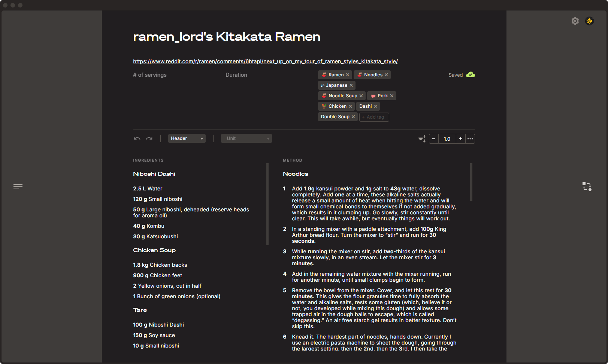

<!-- Improved compatibility of back to top link: See: https://github.com/othneildrew/Best-README-Template/pull/73 -->

<!--
*** Thanks for checking out the Best-README-Template. If you have a suggestion
*** that would make this better, please fork the repo and create a pull request
*** or simply open an issue with the tag "enhancement".
*** Don't forget to give the project a star!
*** Thanks again! Now go create something AMAZING! :D
-->

<!-- PROJECT LOGO -->

  <h1 aria-label="cookbook" align="center">
	  
  </h1>

  

    Your trusty kitchen companion
     
     
    

     
     
	<a href="https://cookbook-b1834.firebaseapp.com/"><strong>🫕 USE THE APP</strong></a>
    ·
    <a href="https://github.com/martinbakerdesign/cookbook/issues/new?labels=enhancement&template=feature-request---.md"><strong>🙋REQUEST A FEATURE</strong></a>
  

<!-- TABLE OF CONTENTS -->

  
Table of Contents

  <ol>
    <li><a href="#features">✨ Features</a></li>
    <li><a href="#usage">👩🏻‍🍳 How to use</a></li>
    <!--<li><a href="#install">🛠️ Install</a></li>-->
    <li><a href="#built-with">📦 Built With</a></li>
    <li><a href="#roadmap">🚧 Roadmap</a></li>
    <li><a href="#roadmap">📜 License</a></li>
    <li><a href="#contact">👋 Contact</a></li>
  </ol>

<!-- FEATURES -->
## ✨ Features

	<ul>
		<li>📥 Import recipes from 10 popular recipe sites</li>
		<li>🪄 Individual quantity/duration conversions</li>
		<li>↔️ Scale recipes</li>
		<li>🤝 Share read-only recipes with your friends</li>
		<li>⏲️ Timers &emsp;&emsp;<small style="background-color: rgba(227, 199, 123, 0.25); border-radius: 9999px; padding: 0.125rem 0.375rem"><small style="vertical-align: 2px;">🚧 COMING SOON 🚧</small></small></li>
		<li>🥣 Mise en place &emsp;&emsp;<small style="background-color: rgba(227, 199, 123, 0.25); border-radius: 9999px; padding: 0.125rem 0.375rem"><small style="vertical-align: 2px;">🚧 COMING SOON 🚧</small></small></li>
	</ul>

(<a href="#readme-top">back to top</a>)

<!-- USAGE EXAMPLES -->
## 👩🏻‍🍳 How to use

### Signup / login

<small style="background-color: rgba(227, 199, 123, 0.25); border-radius: 9999px; padding: 0.125rem 0.375rem"><small style="vertical-align: 2px;">🚧 COMING SOON 🚧</small></small>

### Import a recipe

<small style="background-color: rgba(227, 199, 123, 0.25); border-radius: 9999px; padding: 0.125rem 0.375rem"><small style="vertical-align: 2px;">🚧 COMING SOON 🚧</small></small>

### Share a recipe

<small style="background-color: rgba(227, 199, 123, 0.25); border-radius: 9999px; padding: 0.125rem 0.375rem"><small style="vertical-align: 2px;">🚧 COMING SOON 🚧</small></small>

### Create/edit a recipe

<small style="background-color: rgba(227, 199, 123, 0.25); border-radius: 9999px; padding: 0.125rem 0.375rem"><small style="vertical-align: 2px;">🚧 COMING SOON 🚧</small></small>

(<a href="#readme-top">back to top</a>)

<!-- TECH STACK -->
## 📦 Built With

|      Frontend Framework       |             Richtext Editor             |            Styling             |                 Database                 |
| :---------------------------: | :-------------------------------------: | :----------------------------: | :--------------------------------------: |
| [Svelte](https://svelte.dev/) | [Prosemirror](https://prosemirror.net/) | [SASS](https://sass-lang.com/) | [Firebase](https://firebase.google.com/) |

(<a href="#readme-top">back to top</a>)

<!-- ROADMAP -->
## 🚧 Roadmap 

- [x] 🪄 Individual quantity/duration conversion
- [ ] 📥 Import recipes via URL
	- [x] All Recipes
	- [x] Bon Appetit
	- [x] Epicurious
	- [x] Food
	- [x] Food Network
	- [x] New York Times
	- [x] SBS
	- [x] Serious Eats
	- [x] Tasty
	- [x] The Spruce Eats
	- [ ] Minimalist Baker
	- [ ] Hot Thai Kitchen
	- [ ] Just One Cookbook
	- [ ] Maangchi
	- [ ] Cookie and Kate
	- [ ] RecipeTin Eats
- [ ] 🎨 [Design revamp & additional features](https://www.figma.com/design/qNcnoJQVZbfTYSsgP5GCA6/cookbook-design?m=auto&t=yEeNS2vEQHbQEGot-1)
	- [ ] ⚡ Swap to TailwindCSS for styling
	- [ ] ⏲️ Timers
	- [ ] 🗒️ Notes section
	- [ ] 🥣 Mise en place section
- [ ] 🔑 Add auth providers
	- [x] Google
	- [ ] Facebook
	- [ ] Github
	- [ ] Apple

See the [open issues](https://github.com/github_username/repo_name/issues) for a full list of proposed features (and known issues).

(<a href="#readme-top">back to top</a>)

<!-- LICENSE -->
## 📜 License

Distributed under the GNU License. See `LICENSE` for more information.

(<a href="#readme-top">back to top</a>)

<!-- CONTACT -->
## 👋 Contact

Martin Baker - martin@martinbaker.design

(<a href="#readme-top">back to top</a>)
